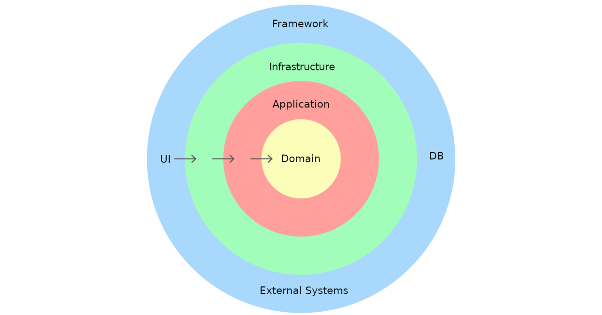

<p align="center"><a href="https://profile-forme.com" target="_blank"></a></p>

<p align="center">
<a href="https://www.linkedin.com/in/tai-nguyen-tien-787545213/"></a>
<a href="https://profile-forme.surge.sh"></a>
<a href="tel:0798805741"></a>
<a href = "mailto:nguyentientai10@gmail.com"></a>
</p>

## This is project coding simple Domain-Driven Design

# DDD (Domain-Driven Design)



# Structure

## Tiếng Việt 🇻🇳

```
src/
├── domain/                   # Logic và quy tắc nghiệp vụ
│   ├── entities/             # Các thực thể nghiệp vụ (User, Ticket, ...)
│   ├── repositories/         # Các giao diện truy cập dữ liệu
│   └── services/             # Các dịch vụ nghiệp vụ
│
├── application/              # Xử lý ứng dụng, quản lý các trường hợp sử dụng
│   └── use-cases/            # Các trường hợp sử dụng cụ thể của hệ thống
│
├── infrastructure/           # Các thành phần hỗ trợ và kết nối
│   ├── database/             # Kết nối và cấu hình cơ sở dữ liệu
│   └── repositories/         # Các triển khai cụ thể của repositories
│
├── interfaces/               # Lớp giao diện, API cho người dùng hoặc hệ thống
│   ├── controllers/          # Các bộ điều khiển logic để xử lý yêu cầu
│   ├── routes/               # Các tuyến API
│   └── middlewares/          # Middleware (xác thực, ghi nhật ký, ...)
│
└── server.js                 # Tệp khởi động ứng dụng chính
```

## English 🇬🇧

```
src/
├── domain/                   # Business logic and rules
│   ├── entities/             # Business entities (User, Ticket, ...)
│   ├── repositories/         # Interfaces for data access
│   └── services/             # Business services
│
├── application/              # Application processing, managing use cases
│   └── use-cases/            # Specific use cases of the system
│
├── infrastructure/           # Supporting components and connections
│   ├── database/             # Database connections and configurations
│   └── repositories/         # Concrete implementations of repositories
│
├── interfaces/               # Interface layer, API for users or systems
│   ├── controllers/          # Logic controllers for handling requests
│   ├── routes/               # API routes
│   └── middlewares/          # Middleware (auth, logging, ...)
│
└── server.js                 # Main application startup file

```

## Tài Khoản Donate li Cf để có động lực code cho anh em tham khảo 😄😄


## Mk: NGUYEN TIEN TAI

## STK: 1651002972052

## Chi Nhánh: NGAN HANG TMCP AN BINH (ABBANK)

## SUPORT CONTACT: [https://profile-forme.com](https://profile-forme.com/).
